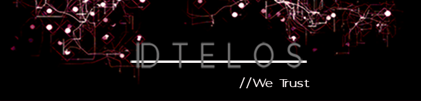
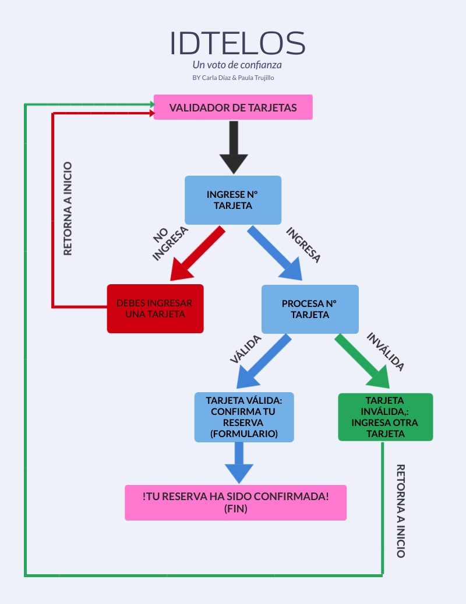

:star: :star: :star: :star: :star: # ***ID-TELOS*** ||  *We Trust* :star: :star: :star: :star: :star:

### INDICE

* [1. INTRODUCCIÓN](#introduccion)
* [2. CONOCIENDO ID-TELOS](#conociendo)	
* [3. PROCESO CREATIVO](#creativo)	
* [4. DISEÑO UX](#diseno)	
* [5. CONCLUSIONES Y REFLEXIONES](#conclusiones)	
* [6. AGRADECIMIENTOS](#agradecimientos)	

***	

<a id="introduccion"> 1. INTRODUCCIÓN***  :arrow_forward: </a>

***ID-TELOS*** es un una aplicación web, cuyo fin es validar la identidad del usuario que accede a nuestra plataforma, logrando así obtener servicios exclusivos en **los mejores moteles de Chile**, que forman parte de nuestra red. Esto se logra a través de la verificación de una tarjeta de crédito válida, y completando un formulario de datos básico. 

<a id="conociendo">  2. CONOCIENDO ID-TELOS	:heart: </a>

***ID-TELOS*** es una plataforma de verificación, cuyo _objetivo final_ es cambiar el paradigma de la experiencia de usuarios, al momento de visitar un motel.

***ID-TELOS*** nace debido a la necesidad profunda de nuestros moteles colaboradores, por mejorar la experiencia de usuario que proveen a sus clientes, pero también debido a la necesidad de estos últimos, quienes constantemente buscan una experiencia de usuario superior, mejorada y renovada. 

No cabe duda que los productos y servicios que ofrecen nuestros moteles asociados, son de excelencia y de primera calidad, pero hacía falta algo, un paso más allá que convirtiera la experiencia de los usuarios de excelente a _Inolvidable_. 

Es ahí donde entra en juego ***ID-TELOS***.

 Somos un garante entre el motel y su cliente, sin que este último deba dejar ninguna garantía de dinero, sino a través de la verificación de una tarjeta de crédito válida, y que esta coincida con los datos de identidad provistos por el usuario. Gracias a esto, el usuario tiene acceso a 2 servicios exclusivos, que cambiarán por completo su experiencia en un motel y a los que solo puede acceder a través de ***ID-TELOS***. 

 - El usuario hará pago de todos los servicios y productos que contrate y requiera, al final de su estadía, y no al momento de ingresar al hotel ni al momento de requerir algo adicional. 

 - El usuario puede reservar habitaciones en su motel preferido, sin tener que dejar una garantía de dinero. 

**¿Cómo funciona?** :eyes: 

EL usuario que desee ser parte de estos beneficios, puede obtener acceso a través de 2 posibles vías: 
 
:black_medium_small_square: Al momento de reservar una habitación en la página web de cualquiera de nuestros moteles asociados, será redireccionado a la plataforma de ***ID-TELOS*** , donde se realizará el proceso de verificación para confirmar su reserva. Con esto el usuario accede a los dos beneficios de nuestro programa. 

:black_medium_small_square: Al momento de llegar a un motel, sin previa reserva. El recepcionista del motel accede directamente a nuestra plataforma, y realiza el proceso de verificación del usuario. Con esto, el usuario puede acceder al beneficio principal de nuestro programa, que es el pago a posteriori, pero no lleva a cabo una reserva previa. 

En ambos casos, se verifica si la tarjeta de crédito provista es válida. En caso de serlo, se accede a un formulario, donde el usuario debe ingresar su nombre, rut y numero de reserva (previamente entregado por el motel donde reservó). 
Con estos datos, se asocia la tarjeta de crédito a una identidad, la cuál será comprobada al momento de hacer ingreso al motel. La tarjeta de crédito va a quedar para siempre ligada a esta identidad. 

Si el usuario desea cancelar la reserva, debe ponerse en contacto directamente con el motel donde reservó, quien en paralelo, nos informa de esta cancelación. 

En caso que el usuario no llegara a cancelar la reserva, se procede a hacer un bloqueo en nuestro sistema, tanto de la tarjeta, como del C.I asociado. Con esto el usuario no podrá acceder nuevamente a ninguno de nuestros moteles asociados. Si el usuario desea cambiar su status de baja, y reintegrarse como usuario activo, este deberá pagar al motel por el servicio impago, así como la multa correspondiente al caso. :sweat_smile:

En caso que el usuario se llegara a retirar del establecimiento sin hacer pago de los servicios y productos solicitados, se procerá al bloqueo definitivo del usuario en nuestra plataforma. También se generará una alarma que será transmitida a moteles fuera de nuestra red de clientes. Además, se procederá a las acciones legales correspondientes. :broken_heart:

<a id="creativo"> 3. PROCESO CREATIVO :rocket: </a>

### :one: La Idea :bulb:

***ID-TELOS*** comienza con el desafío de llevar a cabo una aplicación web, que trabajáse a partir de la validación de un numero de tarjeta de crédito.
Luego de una gran lluvia de ideas, e ires y venires, nos dimos cuenta que, podíamos aplicar este mecanismo, al mundo de los moteles; si bien estos son lugares de alojamiento de paso, su objetivo principal es satisfacer y llevar a cabo las fantasías y deseos de sus clientes; Pero, a pesar de ofrecer productos y servicios de excelente calidad, faltaba un pequeño toque, que no solo apelara a la excelencia, sino lograra hacer sentir a sus usuarios especiales, importantes, alcanzando así a transformar el sentimiento de ser simples usuarios de paso de un excelente servicio, a ser el eje central de la experiencia. 

Es así como, nace ***ID-TELOS***... Somos un voto de confianza entre nuestros clientes y sus usuarios... Un garante participativo, que busca satisfacer tanto las necesidades de nuestros clientes y también de nuestros usuarios. 

### :two: Planificación :date: :pencil2: :open_file_folder:

El proceso de planificación es vital para poder llevar a cabo cualquier proyecto. En nuestro caso, 
nos permitió tener una perspectiva de cuales eran los objetivos a cumplir, versus la cantidad de tiempo que teníamos para ello, pudiendo así dividir este tiempo de manera eficiente entre las distintas etapas de la realización. 

En primer lugar llevamos a cabo un desglose de todas las tareas que teníamos cumplir. 
Para esto utilizamos la plataforma Trello, donde fuimos desglosando cada tarea pendiente, cada tarea realizada, las temáticas a investigar y los objetivos a cumplir.

[Visita acá nuestro Trello](https://trello.com/b/lSGqxOUp/proyecto-tarjeta-credito)

Luego, procedimos a calendarizar todas estas tareas, dividiendo la planificación en 2 Sprints, cada uno con una duración de una semana. Sprint 1 corresponde a "Planificación e Investigación" y Sprint 2 corresponde al "Desarrollo de la aplicación en sí". 

[Visita acá nuestro Calendario](https://trello.com/b/JmJqEL8U/planning-laboratoria-01)

Es muy importante llevar a cabo este paso, ya que va a permitir verificar de manera efectiva, si contamos con los recursos suficientes para poder llevar nuestro proyecto, así como distribuirlos de manera eficiente. 

También es fundamental ir diariamente revisando los avances, los pendientes e ir reorganizando las tareas en el tiempo, según sea pertinente a las necesidades del desarrollo del proyecto, ya que todos los procesos creativos y de desarrollo son dinámicos, por ende, estan sujetos a cambios, por tanto, es clave lograr identificar cuando debemos comprender estos cambios y adaptar nuestro procesos a ellos. 

Ya con toda la planificación lista, procedimos a trabajar en nuestro proyecto. 

### :three: Investigación y Desarrollo :chart_with_upwards_trend:

La primera parte del proceso de investigación consistió en definir las lineas investigativas, en las diversas áreas a trabajar, las cuales són HTML, CSS, JavaScript. 
Acordamos posibles caminos para resolver nuestras interrogantes en cuanto la teoría y aplicación de esta misma, en función de la construcción de nuestro programa. 
Fuimos dividiendo las temáticas y tareas, y a la vez también trabajando en conjunto y compartiendo las nuevas ideas y conocimientos, para ir paso a paso avanzando en el proyecto. 

Con un marco teórico establecido, procedimos realizar un diagrama, para definir el flujo que tendría nuestra aplicación, y asi tener identificado el paso a paso de las tareas a realizar en el código. 

Basado en esto creamos un prototipo del programa, el cuál fue testeado en usuarios que cumplieran con el perfil construido. Veremos esto en detalle en nuestra próxima sección. 

Luego de tener un feedback después de las pruebas de usuario, procedimos a crear una maqueta de nuestro programa, la cuál tuvo un testeo final, y sobre la cuál trabajamos y comenzamos a codear. 

El resultado de nuestro programa, es el punto cúlmine de todo nuestro proceso de trabajo y aprendizaje para la construcción de este programa. Si bien no se logró completar en un 100%, cada paso fue concientemente internalizado y también implicó de nuestro esfuerzo, trabajo y dedicación. 

<a id="diseno">  4. DISEÑO UX :iphone: :ok_hand:</a>

El proceso de Diseño UX fue una pieza clave para el desarrollo de esta aplicación.
Nuestro proyecto, al tener un fin que se enfoca netamente a elevar la experiencia de usuario de quienes nos escogen, es vital que tenga un proceso de diseño nutrido y profundo. 
A continuación vamos a detallar los diferentes pasos que fuimos dando, en el proceso de diseño de la experiencia de usuario. 

### Nuestros Usuarios :couple: :two_women_holding_hands: :two_men_holding_hands:

Nuestros clientes directos son los moteles pertenecientes a nuestra cadena de colaboradores, quienes buscan incansablemente el bienestar y satisfacción de sus clientes, quienes son los  usuarios principales de nuesstra aplicacón. 

Nuestro Cliente tiene la necesidad de mejorar su servicio, para así, no solo fidelizar a su clientela, sino para crear un vínculo indisoluble de confianza, la cuál apunta a transformar por completo la experiencia de sus usuarios. 

Por otra parte, los usuarios de nuestra aplicación, son personas adultas, quienes tienen una preferencia por los servicios y productos que eleven su experiencia de usuario; Mientras mejor la experiencia, más satisfecho queda este usuario. 
Este usuario está en una constante búsqueda por mejorar su experiencia, y está dispuesto a invertir recursos en para que así sea. 

Según esto, y según los fines de nuestra aplicación, podemos dividir a nuestros usuarios en los siguientes perfiles. 

***PERFIL DE USUARIO ***

Tenemos 3 posibles tipos de usuario para esta experiencia.  

A)	Usuario que reserva su habitación a través de la web de un motel perteneciente a nuestra red. 
El usuario es redireccionado a nuestra plataforma, a través de la web de motel, para terminar de confirmar su reserva. 
B)	Recepcionista de motel, quien recibe a usuario sin reserva previa, pero que desea pagar por sus productos y servicios al final de su estadía. Recepcionista accede a plataforma de manera directa y verifica la identidad del usuario. 
C)	Usuario indirecto, quien no entra a la plataforma, pero accede al servicio de pagar su cuenta al final. 

**Perfil Usuario A:** 

Hombres y mujeres. 
Mayores de 18 años. 
Con acceso a una tarjeta de crédito. 
Con acceso a plataforma web. 

Necesidades Usuario A: 

Nuestro Usuario A, es un hombre o mujer, mayor de edad, con acceso a servicios bancarios. 
Este usuario suele y disfruta asistiendo a su motel preferido en la fecha y hora que desee, pero necesita asegurarse, de que al momento de llegar, la habitación que desean esté disponible para ellos. 
Nuestro usuario está dispuesto a gastar un poco de su tiempo en reservar online, con el fin de tener un experiencia superior, cuando visita motel. Para este usuario, pagar su cuenta al final del servicio, lo hace sentir especial, importante, por ende su experiencia de usuario mejora en comparación a un servicio regular. Siente que el hotel es un espacio donde confían en él, por tanto, su estadía es más agradable y amena. 

Este usuario necesita:

* Una plataforma rápida y sencilla, que le permite hacer el proceso en el menor tiempo posible.
* Una plataforma con interfaz discreto y neutral. 
* Un servicio confiable, que no descuente dinero de sus tarjetas. 
* Un servicio que lo haga sentir que es importante y que confían en él. 

***Perfil Usuario B***

Hombres y mujeres trabajadores de los moteles de la red. 
Mayores de 18 años. 
Con acceso a plataforma web. 

Necesidades Usuario B:

Usuario B accede a plataforma no por sí mismo, sino como parte de su trabajo. 
Si bien este usuario no tiene una necesidad propia para utilizar esta aplicación, de todas maneras queremos que su experiencia sea buena y no tenga problemas para llevar a cabo su misión, ya que es una de las responsabilidades de su labor, la cuál queremos que sea exitosa, expedita y que no genere problemas. 

Este usuario necesita: 

* Una plataforma rápida y sencilla, que le permite hacer el proceso en el menor tiempo posible.
* Un servicio que haga fácil su trabajo y que sea agradable cada vez que tiene que acceder a la plataforma.

***Perfil Usuario C***

Hombres y mujeres. 
Mayores de 18 años. 
Con acceso a una tarjeta de crédito. 

Nuestro Usuario C es un usuario pasivo, ya que no ingresa directamente a nuestra plataforma, pero si puede acceder al servicio, a través de un tercero, que es el trabajador del motel. De todas maneras, es importante que en este paso, no se vea afectada la experiencia del usuario, por ende es fundamental que sea un servicio rápido, confiable y que no aporte al bienestar del cliente. 

Este usuario necesita:

* Una plataforma rápida y sencilla, que le permita a un tercero, hacer el proceso en el menor tiempo posible.
* Un servicio confiable, que no descuente dinero de sus tarjetas. 
* Un servicio que lo haga sentir que es importante y que confían en él. 

### Interfase y Prototipado :memo: :computer:

El proceso de prototipado fue fundamental para el desarrollo de nuestra aplicación. 
En primer lugar nos sirvió para poder llevar a cabo un acercamiento inicial a la visualidad de nuestro proyecto. Con esto, pudimos comenzar a desarrollarlo y a realizar pruebas de usuarios, donde a partir del feedback recibido, tuvimos la posibilidad de cambiar y hacer mejoras a nuestro proyecto. 
El prototipado fue la base a partir de la cuál pudimos comenzar a trabajar y hacer crecer nuestro programa. 

A continuación, detallamos el paso a paso de este proceso. 

Comenzamos haciendo sketchs a mano, los cuales, luego de varias versiones en borrador,pasamos en limpio. Este Sketch, esta basado en el diagrama de flujo que pudieron ver en la sección anterior. 

Un vez listo este sketch a mano, lo digitalizamos con el programa InVision. 

Con este primer acercamiento digital, procedimos a hacer una pequeñas mejoras, y creamos nuestro primer prototipo, también con el programa Invision. EN este caso, ya habíamos tomado algunas deciones formales, cómo eliminar la pantalla cancelar, y también utilizar un banner como header. 

[Visita acá nuestro Prototipado](https://paulatrujillo960530.invisionapp.com/console/IDTELOS_V1-ck8gcwdli01cd014sfep1hncz/ck8gcwuz601fb019ts782857p/play)

Con este prototipo listo, procedimos a hacer pruebas de usuarios. 

Escribimos un guión para pautar la prueba y procedimos a reunir 5 usuarios, mayores de edad, hombres y mujeres, con acceso a tarjeta de créditos y clientes de moteles. 

[Revisa acá nuestro guión](https://trello.com/c/R6JqlPFy/12-definir-usuario-necesidades-guion-test)

Acordamos reuniones vía zoom, las cuales grabamos, con autorización y bajo confidencialidad. 

Les dimos acceso a un link, donde pudieron navegar a través del protipo.

Una vez finalizadas las pruebas, pudimos obtener la siguiente información:

:o: Existen los usuarios perfilados. 

:o: El usuario siempre está en búsqueda de una mejor experiencia de usuario. 

:o: El usuario está dispuesto a invertir diversos recursos, con el fin de acceder a una experiencia superior. 

:o: Al usuario le complacen enormemente los servicios ofrecidos por ID-TELOS. 

:o: ***ID-TELOS*** resulve las necesidades, tanto de los clientes como de los usuarios. 

:o: Al usuario le da confianza que no se descuente dinero de la tarjeta de credito. 

:o: El usuario prefiere una plataforma rápida, eficaz y sencilla. 

:o: El usuario busca una interfaz simple, discreta y que no haga alusiones directas a moteles. 

:o: Es fundamental tener un buen diseño visual de la interfaz. 

Gracias a toda esta información y retroalimentación, reformulamos nuestro proyecto, y creamos un diagrama de flujo nuevo, donde fuera más eficaz el flujo de la aplicación. 

Con esto creamos una maqueta final de nuestra aplicación, con la cual realizamos nuevas pruebas de usuarios. 

[Revisa acá nuestra maqueta](https://carladaz131271.invisionapp.com/console/credito-final-ck8xv74aq3ir20154vod1x5zd/ck90gsrig01su01aro7tmqrgm/play)

Luego de estas segundas pruebas pudimos confirmar la información que otuvimos en las primeras pruebas, y adicionalmente comprobamos que. 

:o: Mejoró el flujo de la aplicación.

:o: Es fundamental presentar al usuario una interfaz y diseño que se acerque a la realidad de lo que va a ser la aplicación, ya que aporta mucho a la concepción del usuario, ver el producto lo más cercano posible a la realidad. 

Dicho todo esto, nuestro producto final se ve así:

La interfase fue definida en cuanto a las necesidades de nuestros usuarios. Una plataforma sencilla, rapida y discreta, que no revele a primera vista de que se trata, pero que al mismo tiempo, también refleje la esencia de ***ID-TELOS***.
 Evitamos las vueltas sin sentido en el programa y nos enfocamos en hacer una plataforma com un buen flow y un diseño moderno, seductor y eficaz. 

<a id="conclusiones"> 5. CONCLUSIONES Y REFLEXIONES :heavy_check_mark: :clap: :clap: :clap:</a>

Todo el proceso de la creación de esta aplicación fue realmente interesante y desafiante. Somos un equipo que está comenzando 100% desde cero, y cada paso del proceso fue un reto a nivel investigativo, teótico y de aprendizaje, lo cual hizo que tuvieramos que poner el 200% de nosotras. 

Nos dimos cuenta que, a pesar que estuvimos siempre trabajando para sacar adelante el proyecto, el recurso tiempo se nos hizo corto, ya que no logramos completar el proyecto en su totalidad. Esto nos sirve de experiencia, ya que para un futuro proyecto, sabemos que tenemos que poner el doble de recursos en lo que más nos cuesta, así como comenzar por lo que más nos cuesta, porque lo que se nos hace más fácil, va a salir rápidamente. 

También es muy importante destacar que para nosotras fue fundamental el trabajo en equipo, ya que gracias a eso, pudimos apoyarnos en nuestros conocimientos, e ir trabajando juntas nuestras debilidades, para así ir aprendiendo en conjunto a lo largo del camino. 

Descubrimos que es muy interesante el procesos de diseño UX, el cuál disfrutamos de gran manera, y llevamos a cabo con mucha pasión. 

En cuanto al proyecto en sí, podemos decir que ***ID-TELOS*** si cumple con su objetivo final, ya que los servicios que ofrece, permiten tanto a los moteles ofrecer una mejor experiencia de usuario para sus clientes, y así como los usuarios, pueden acceder a servicios que van a satisfacer su búsqueda por acceder a una experiencia de usuario superior. 

Gracias a todas las pruebas de usuarios realizadas, tenemos en consideración algunos puntos que nos pueden servir para mejoras en el futuro, de la próxima versión de ***ID-TELOS***. Dentro de las mejoras sugeridas por los usuarios  queremos rescatar las siguientes:

:red_circle: Que ***ID-TELOS*** eventualmente se convierta en una plataforma, no solo de verificación, sino en una comunidad, donde se pueda acceder directamente a la información de los moteles de nuestra red, algo así como un "airbnb" de moteles. 

:red_circle: Que la plataforma permita directamente comprar productos y servicios adicionales en la reserva. 

:red_circle: Que las cancelaciones se hagan directamenta través de nuestra plataforma. 

Todo esto y más, los espera para nuestra versión 2.0. 

<a id="agradecimientos"> 6. AGRADECIMIENTOS  :cupid: </a>

Agradecemos en primer lugar a nuestras familias, quienes fueron un apoyo fundamental en todo este proceso, apoyándonos en nuestras casas, y siendo comprensivos ante nuestra ausencia y trabajo arduo de estos días. 

Tambien queremos agradecer al equipo de laboratoria, a nuestro Jedi y a nuestras Coachs y psicólogas, quienes fueron un apoyo fundamental para poder ir avanzando en los desafíos que implicaba la realización de este proyecto, así como un apoyo emocional para albergar todos nuestros procesos y sentimientos a flor de piel. 

Por último, pero no menos importante, queremos agradecer a nuestras compañeras de Squad, quienes siempre estuvieron ahí para darnos una palabra de aliento, un consejo, o simplemente con su compañerismo, que fue una dosis vitaminica para todas, en esta grandiosa experiencia. 

#####Copyright by Carla Díaz y Paula Trujillo, 2020. 